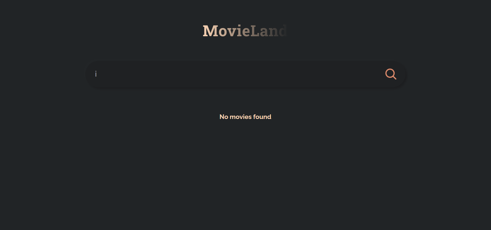

# 🎬 Movie App using ReactJS

A dynamic and beginner-friendly **Movie App** built with **ReactJS**. This project allows users to search and browse movies with real-time updates using an external API. Great for learning API integration and managing component state with hooks.

## 🚀 Live Demo

👉 [Live App](https://movie-app-beryl-six-33.vercel.app/)

## 🛠️ Tech Stack

- **ReactJS**
- **JavaScript (ES6+)**
- **CSS**
- **OMDb API / TMDB API (assumed for movie data)**

## ✨ Features

- Movie search functionality
- Display movie posters and basic info
- Loading states and error handling
- Responsive and clean design
- React Hooks (`useState`, `useEffect`) usage

## 📚 Ideal For

- ReactJS Beginners
- API Integration Practice
- Building Real-Time Search Features
- UI/UX and State Management Practice

## 📫 Contact Me

- **📧 Email:** muhdzaheermv@gmail.com  
- **🔗 Portfolio:** [https://portfolio-lilac-eight-60.vercel.app/](https://portfolio-lilac-eight-60.vercel.app/)  
- **💼 LinkedIn:** [https://www.linkedin.com/in/muhammed-zaheer-836132244/](https://www.linkedin.com/in/muhammed-zaheer-836132244/)

## ⭐ Like This Project?

If this helped you or inspired you, don't forget to **⭐ star** the repository — it really helps and means a lot!

